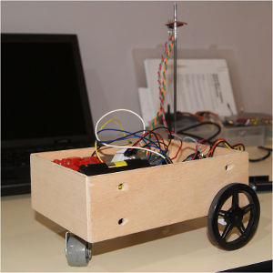
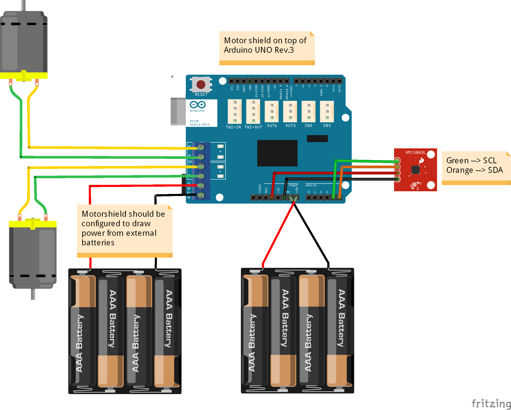

Arducar
=======
A simple robot car made with Arduino. 

This project was carried out during an [ITSAS](http://ehu.es/itsas) workshop in the [Facultad de Informática de San Sebastián](http://www.ehu.es/informatika-fakultatea).  

Thanks to all the participants and the rest of the people who made this possible.  

Short description + Components
------------------------------
This autonomous robot car follows a straight path. Once set on a surface the robot meassures its deviation from the earth's magnetic north and tries to stick to that deviation when moving forwards (allowing a small error).

The car was built using the following core elements: an arduino UNO (Rev.3) board, a [dfrobot motor shield](http://www.dfrobot.com/index.php?route=product/product&product_id=69) and a HMC5883L magnetometer.

This robot is powered by 8 AA (1'5V) batteries. 4 of them power the motors, through the motor shield, and the other 4 power the arduino UNO board.

Schematic
---------

License
-------
This code is in public domain. 
A link to the this project would be appreciated in case you publish something based on the code or schematics herein available.
